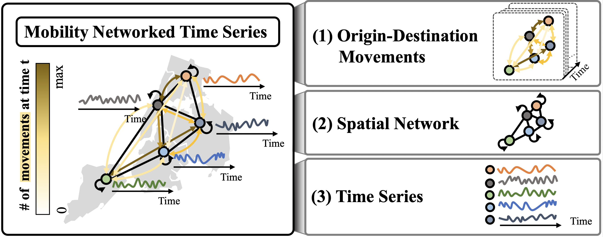
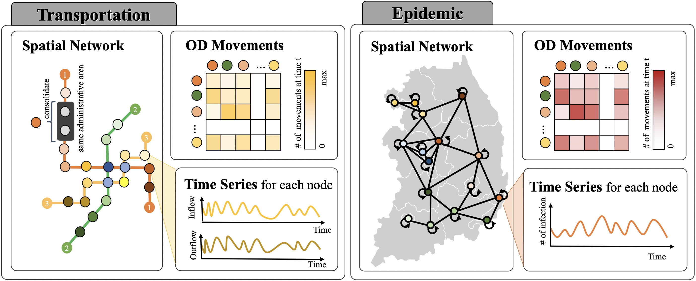

# Mobility Networked Time-Series Forecasting Benchmark Datasets
This is the official repository of  **MOBINS** (**MOBI**lity **N**etworked time **S**eries), a novel dataset collection designed for networked time-series forecasting of movements. 

<!--  -->


## 1. Overview
Human mobility is crucial for urban planning (e.g., public transportation) and epidemic response strategies. However, existing research often neglects integrating comprehensive perspectives on spatial dynamics, temporal trends, and other contextual views due to the limitations of existing mobility datasets. To bridge this gap, we introduce **MOBINS** (**MOBI**lity **N**etworked time **S**eries), a novel dataset collection designed for networked time-series forecasting of dynamic human movements. **MOBINS** features diverse and explainable datasets that capture various mobility patterns across different transportation modes in four cities and two countries and cover both transportation and epidemic domains at the administrative area level. Our experiments with nine baseline methods reveal the significant impact of different model backbones on the proposed six datasets. We provide a valuable resource for advancing urban mobility research, and our dataset collection is available at DOI 10.5281/zenodo.14590709.

## 2. Proposed Benchmark Datasets
Due to the big dataset size, we released it on the anonymous drive.
- `csv format` data: [all csv files link](https://drive.google.com/file/d/1zC1oIHfZGqkvl1jGl-16xfstWI15m6yJ/view?usp=sharing). If you want to download each dataset, please use the below links. 
   -  `Transportation-Seoul`: [csv file link](https://drive.google.com/file/d/1MPkqpoeysY6tF-LUuya-bai5V0Fygx77/view?usp=sharing) 
   -  `Transportation-Busan`: [csv file link](https://drive.google.com/file/d/1PU9aqp7kc4UzuFOAqLPkraM5MbmtyodM/view?usp=sharing) 
   -  `Transportation-Daegu`: [csv file link](https://drive.google.com/file/d/1ggcUHlpT7QCYB1jwlouhZLgM2FzDnuKU/view?usp=sharing) 
   -  `Transportation-NYC`: [csv file link](https://drive.google.com/file/d/1R97wE9_v2WVAS1MAWKUbZWOhPQNQYCnV/view?usp=sharing) 
   -  `Epidemic-Korea`: [csv file link](https://drive.google.com/file/d/1G0P4-HdRoU6X2p18VmOaEMJVPIUEEhiE/view?usp=sharing)
   -  `Epidemic-NYC`: [csv file link](https://drive.google.com/file/d/1ZGiXpG6JpSRLQLllv6CefnM62NVRZLtk/view?usp=sharing)
- `npy format` dataset to train the baselines: [all npy files link](https://drive.google.com/file/d/1_kgT79BKyXKfJvmt8aYlSNF8i8ykSOLt/view?usp=sharing). If you want to download each dataset, please use the below links. 
   -  `Transportation-Seoul`: [npy file link](https://drive.google.com/file/d/14QfBDA_R-PFXdoad5oR4S_lxSFdveRgN/view?usp=sharing) 
   -  `Transportation-Busan`: [npy file link](https://drive.google.com/file/d/1yWhGQ1REHUO2u8C56CYIhfCYQh2WnpJt/view?usp=sharing) 
   -  `Transportation-Daegu`: [npy file link](https://drive.google.com/file/d/1dj68ZwJC9kr8VlU6fIdHtq46htUHQ_94/view?usp=sharing)
   -  `Transportation-NYC`: [npy file link](https://drive.google.com/file/d/1-UkDLGyXSwPyFwgfMeDyw2-zLIQyMEYD/view?usp=sharing) 
   -  `Epidemic-Korea`: [npy file link](https://drive.google.com/file/d/1HYH_M-gYTRBk58XVQtjJTKOosPV-ovn9/view?usp=sharing)
   -  `Epidemic-NYC`: [npy file link](https://drive.google.com/file/d/1m7dHXhyQ6khLLcJyWZg06L0uGLThV303/view?usp=sharing)

Additional information
- [MOBINS_Analysis.pdf](https://anonymous.4open.science/r/MOBINS/assets/MOBINS_Analysis.pdf)
- [MOBINS_Results.pdf](https://anonymous.4open.science/r/MOBINS/assets/MOBINS_Results.pdf)
- [MOBINS_Metadata.pdf](https://anonymous.4open.science/r/MOBINS/assets/MOBINS_Metadata.pdf)

 
### Formats of datasets
- `csv format` datasets in every environment: each dataset has three components.
   - `SPATIAL_NETWORK.csv`: ( $n * n$ where $n$ = # of nodes ) 
      - Column name list: INDEX, $N_{0}$, $N_{1}$, $\dots$, $N_{n}$ 
      - INDEX list: $N_{0}$, $N_{1}$, $\dots$, $N_{n}$
   - `NODE_TIME_SERIES_FEATURES.csv`:  ( $t$ * $p$ ) * ( $n$ * $d$ ) where $t$ = # of timestamps in a day, $p$ = total period, and $d$ = # of variables from time series
      -  Column name list: datetime, $N_{0}$ \_{VARIABLE_NAME}, $N_{1}$ \_{VARIABLE_NAME}, $\dots$, $N_{n}$ \_{VARIABLE_NAME}
      -  VARIABLE_NAME list: _Transportation-[Seoul, Busan, Deagu]}_ datasets (**INFLOW**, **OUTFLOW**), _Transportation-NYC_ dataset (**RIDERSHIP**), _Epidemic-[Korea, NYC]_ dataset (**INFECTION**)
   - `OD_MOVEMENTS.csv`:  ( $t$ * $p$ ) * ( $n$, $n$ ) 
      - Column name list: $N_{0}$ _ $N_{0}$, $N_{0}$ _ $N_{1}$, $N_{0}$ _ $N_{2}$, $\dots$ , $N_{n}$ _ $N_{n-1}$ , $N_{n}$ _ $N_{n}$
- `npy format` datasets for directly training the models on the Python environments: each dataset has three components.
   - `adj_matrix`(shape: ( $n$ , $n$ )) where $n$ = # of nodes
   - `node_npy`(each file is constructed in a daily manner with shape: ( $n$, $t$ , $d$ )) where $t$ = # of timestamps in a day and $d$ = # of variables from time series
   - `od_npy` (each file is constructed in a daily manner with shape: ( $n$, $n$, $t$ )) 

**More detailed metadata is located in the `datasets/README.md`.**


### Dataset Descriptions
- Overview of dataset description

<!--  -->


- Target dimension: OD Movements + Time Series = $n^2 + d*n$ where $n$ = # of nodes and $d$ = # of variables

| Dataset        | Locations    | Spatial node units | Edges | Domain                | Daily Movements | Daily Amounts                     | Time interval | Time Range              | Frames | Target dimension |
|----------------|--------------|--------------------|-------|-----------------------|-----------------|-----------------------------------|---------------|-------------------------|--------|------------------|
| **Transportation** | Seoul        |                128 |   290 | Station-based administrative area | SmartCard:2.68M         | In/Out-flow:4.02M | 1 hour        | 01/01/2022-12/31/2023 |  17520 |            16640 |
|                | Busan        |                 60 |   121 | Station-based administrative area | SmartCard:0.63M          | In/Out-flow:0.75M   | 1 hour        | 01/01/2021-12/31/2023 |  26280 |             3720 |
|                | Daegu        |                 61 |   123 | Station-based administrative area | SmartCard:0.10M          | In/Out-flow:0.34M   | 1 hour        | 01/01/2021-12/31/2023 |  26280 |             3843 |
| |NYC|5|12|Borough|Taxi:0.10M|Ridership:3.03M| 1 hour |02/01/2022-03/31/2024|17280|30|
|**Epidemic**|Korea|16|45|City&Province|SmartCards:13.41M|Infection:25834|1 day| 01/20/2020-08/31/2023|1320|272|
| |NYC|5|12|Borough|Taxi:2418|Infection:2038|1 day|03/01/2020-12/31/2023|1401|30|

<!-- meta dataset -->


## 3. Experiments with baselines 

 All experiments are conducted on a server with an NVIDIA RTX 3090Ti GPU.

**Baseline list**
 - Linear-based: `DLinear`, `NLinear`
 - RNN-based: `SegRNN`
 - Transformer-based: `Informer`, `Reformer`, `PatchTST`
 - CNN-based: `TimesNet`
 - GNN-based: `STGCN`, `MPNNLSTM`

### 3-1. Requirements and Installations
- [Node.js](https://nodejs.org/en/download/): 16.13.2+
- [Anaconda 4](https://docs.conda.io/projects/conda/en/latest/user-guide/install/index.html) or [Miniconda 3](https://docs.conda.io/en/latest/miniconda.html)
- Python 3.11.5 (Recommend Anaconda)
- Ubuntu 18.04.6 LTS
- pytorch >= 2.1.2


### 3-2. How to prepare datasets 
- After you download the **MOBINS** dataset collection in the `npy format` files, please refer to the below file structure.
- Each dataset has a `NODE_TIME_SERIES_FEATURES` folder, an `OD_MOVEMENTS` folder, and an `SPATIAL_NETWORK.npy` file (i.e. same file structure).
```bash
datasets
|_ README.md
|_ Transportation-Seoul
    |_ NODE_TIME_SERIES_FEATURES          # daily record files
       |_ ....
    |_ OD_MOVEMENTS                       # daily record files
       |_ ....
    |_ SPATIAL_NETWORK.npy
|_ Transportation-Busan
    |_ ...
|_ Transportation-Daegu
    |_ ...
|_ Transportation-NYC
    |_ ...
|_ Epidemic-Korea
    |_ ...
|_ Epidemic-NYC
    |_ ...
```
- If you want to change your change dataset dir, please change `dataset_loader.py` > function `load_datasets` > `ROOT_PATH`
```code
def load_datasets(dataset, khop=0, only_adj=False, ar_adj=False,opts=None):
    # Dataset directory
    ROOT_PATH = './dataset/'  # CHANGE YOUR DIR
```

### 3-3. Configuration
**MOBINS** was implemented in **Python 3.11.5.**
- Edit main.py file to set experiment parameters (dataset, seq_length, gpu_id(e.g. 0,1,2,3,4,5), etc.)
```bash
python3 main.py
```

### 3-4. How to run
- How to change the parameter options: Please refer to the parameter options below.
```bash
  --dataset: the name of dataset (string) (e.g) seoul, busan, daegu, nyc, korea_covid, nyc_covid
  --seq_day: the size of a lookback window (integer)
  --pred_day: the size of a prediction window (integer)
  --gpu_id: an integer gpu id
```

- How to execute bash files: (e.g.) DLinear model about `Epidemic-korea` with diverse seq_day 4 and pred_day (7, 14, 30) 
```bash
bash example_bash.sh
```

- How to directly execute the Python file in the terminal: (e.g.) DLinear model about the `Epidemic-korea` dataset
```bash
python3 main.py --gpu_id 1 --model_name DLinear --gpu_id 0 --batch_size 8 --dataset korea_covid --seq_day 4 --pred_day 7 
```

## 4. Evaluate Your Models
1. Upload your model into the `comparisons` folder.
2. Add your model information on `baseline.py` file.
```code
# first, add your model name on from comparisons import  
from comparisons import DLinear, Autoformer, PatchTST, TimesNet, Informer, NLinear, SegRNN, Reformer, STGCN, MPNNLSTM, your_model_name

# second, add your model name on model_dict
class Prediction(object):
   # .... other code 
    def build_models(self):
        ### Add your model ####################
        model_dict = {
            'Autoformer': Autoformer,
            'PatchTST': PatchTST,
            'DLinear': DLinear,
            'TimesNet': TimesNet,
            'Informer': Informer,
            'NLinear': NLinear,
            'SegRNN': SegRNN,
            'Reformer': Reformer,
            'STGCN': STGCN,
            'MPNNLSTM':MPNNLSTM,
            'your_model_name':your_model_name
        }
        #########################################
```
3. Run your code.
```
python3 main.py --model_name 'your_model_name'
```

## 5. License
- The `Transportation-[Seoul, Busan, Daegu, NYC]` and  `Epidemic-NYC` datasets are released under a [CC BY-NC 4.0 International License](https://creativecommons.org/licenses/by-nc/4.0).
- The `Epidemic-Korea` datasets are released under a [CC BY-NC-ND 4.0 International License](https://creativecommons.org/licenses/by-nc-nd/4.0/).
- Our code implementation is released under the [MIT License](https://opensource.org/licenses/MIT).

## 6. Data Source Reference
- **References of Origin-Destination Movements**
  - `Transportation-Seoul`: [Korea Public Data Portal](https://www.data.go.kr/en/data/15081036/fileData.do) and [Smart Transit Card Information System](https://stcis.go.kr/wps/main.do)
  - `Transportation-[Busan,Daegu]`: [Smart Transit Card Information System](https://stcis.go.kr/wps/main.do)
  - `Transportation-NYC`: [NYC Taxi and Limousine Commission(TLC)](https://www.nyc.gov/site/tlc/about/tlc-trip-record-data.page)
  - `Epidemic-Korea`: [Smart transit card information system](https://stcis.go.kr/wps/main.do)
  - `Epidemic-NYC`: [NYC Taxi and Limousine Commission(TLC)](https://www.nyc.gov/site/tlc/about/tlc-trip-record-data.page)

- **References of Time Series**
   - `Transportation-Seoul`: Korea Public Data Portal (Seoul subway [line 1-8](https://www.data.go.kr/en/data/15048032/fileData.do) and [line 9](https://www.data.go.kr/en/data/15060424/fileData.do))
   - `Transportation-[Busan,Daegu]`: Korea Public Data Portal ([Busan](https://www.data.go.kr/en/data/3057229/fileData.do) and [Daegu](https://www.data.go.kr/en/data/15002503/fileData.do))
   - `Transportation-NYC`: [NYC Data Portal](https://data.ny.gov/Transportation/MTA-Subway-Hourly-Ridership-Beginning-February-202/wujg-7c2s)
   - `Epidemic-Korea`: [Korea Disease Control and Prevention Agency](https://ncv.kdca.go.kr/pot/cv/trend/dmstc/selectMntrgSttus.do) 
   - `Epidemic-NYC`: [NYC Health](https://github.com/nychealth/coronavirus-data/blob/master/trends/cases-by-day.csv)

[note] All source websites support the official English version except `Smart Transit Card Information System` and `Korea Disease Control and Prevention Agency`. Therefore, we write down how to contact or use two source datasets. 
- Uses of `Smart Transit Card Information System`: Please contact this email (stcis@kotsa.or.kr).
- Time Series of `Epidemic-Korea`: [direct download link](https://ncv.kdca.go.kr/pot/component/resrce/file/ND_resrceFileDownload.do?dataSn=264&chgCycl=1&fileSn=1). If you want to contact the reference, please use [this official English link](https://www.kdca.go.kr/index.es?sid=a3).

## 7. Code Reference
we implemented our benchmark code based on [Time Series Library (TSLib)
](https://github.com/thuml/Time-Series-Library).
   - DLinear: https://github.com/cure-lab/LTSF-Linear
   - NLinear: https://github.com/cure-lab/LTSF-Linear
   - SegRNN: https://github.com/lss-1138/SegRNN
   - Informer: https://github.com/zhouhaoyi/Informer2020
   - Reformer: https://github.com/lucidrains/reformer-pytorch
   - PatchTST: https://github.com/yuqinie98/PatchTST
   - TimesNet: https://github.com/thuml/TimesNet
   - STGCN: https://github.com/hazdzz/STGCN
   - MPNNLSTM: https://github.com/geopanag/pandemic_tgnn

## Citation
```
@inproceedings{na2025mobility,
  title={Mobility Networked Time Series Benchmark Datasets},
  author={Na, Jihye, and Nam, Youngeun, and Yoon, Susik and Song, Hwanjun and Lee, Byung Suk and Lee, Jae-Gil},
  booktitle={ICWSM},
  year={2025},
}
```

## Acknowledgement
This work was supported by the National Research Foundation of Korea (NRF) grant funded by the Korea government (Ministry of Science and ICT) (No. 2023R1A2C2003690).
